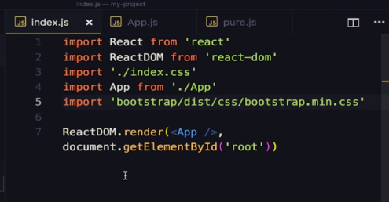
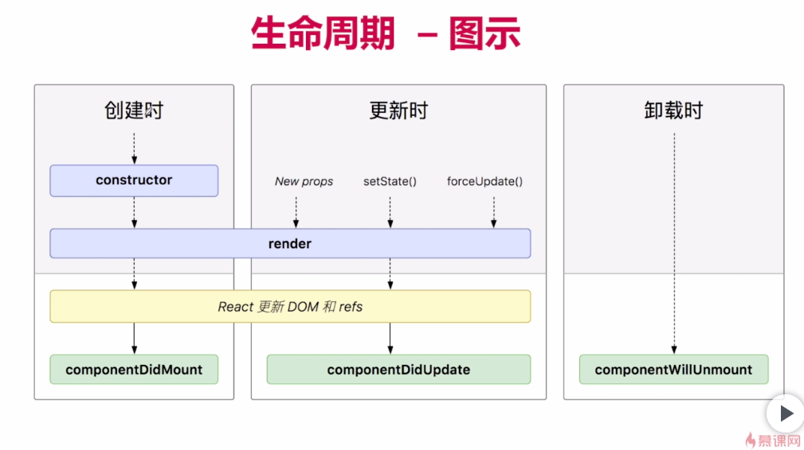

### 使用bootstrap

如果想使用bootstrap，将bootstrap包直接放在react项目的src目录下，然后在index.js 文档上方引入该css文件，这样就可以在APP.js里直接使用

> 例：import 'bootstrap/dist/css/bootstrap.min.css';
>
> 再在react的index.html文件中加个jQuery的引入，因为bootstrap以来jQuery

### react生命周期

### 在React里想使用JQuery

安装

> npm install jquery -S

然后在使用jq语法的js文件上方引入即可

> import $ from 'jquery'

### React里图片src注意事项

在React里img标签的src属性除了给远程地址，本地都需要使用require引入；

而require除了直接给链接字符串，想使用变量必须将地址至少拆分成两部分

> src*=*{require('./images/' *+* imgsrc)}   这里的imgsrc是一个存储了带后缀文件名的变量

### github上传react项目

> react创建项目时，会自动创建.git文件夹，移入本地仓库后需删除，要不会起冲突
>
> react项目目录下还有.gitignore文件，使忽略node_modules文件夹，另有package.json文件会记录此项目安装有什么模块，从git远程仓库克隆下来后可以通过相关命令自动下载记录的模块